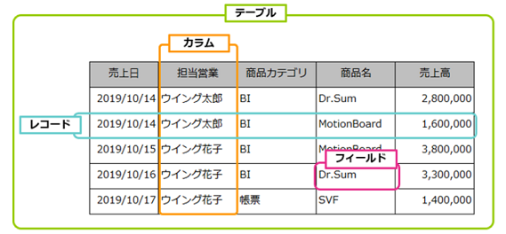

## ① RDBMSにおけるテーブル（表）・カラム（列）・レコード（行）とは何か。またこれらの関係性は。

* テーブル：データベース内でデータを格納する領域全体のこと。
* カラム：テーブルの垂直方向の並びのことで、特定の種類に関する様々なデータを持っている。
* レコード：テーブルの水平方向の並びのことで、特定のモノに関する様々なデータを持っている。  

## ② MySQL/MariaDBのカラムに定義するデータ型について、以下を扱う場合はどのデータ型を用いるのか。

### 1. 整数

`INT` または `UNSIGNED INT`

### 2. 小数（固定小数点）

`DECIMAL` または `NUMERIC`

### 3. 日付（「2020/01/01」のように日にちまでの値）

`DATE`

### 4. 時間（「12:34:56」のように時間だけの値）

`TIME`

### 5. 日時（「2020/01/01 12:34:56」のように日時両方含む値）

`DATETIME` または `TIMESTAMP`

### 6. 文字列

`VARCHAR` または `CHAR`

### 7. 65535文字を超える文字列

`LONGTEXT` または `MEDIUMTEXT`

## ③ SQLとは何か。

データベース言語の一つで、データベース言語とは「データベースを操作するための言語」のこと。データベースにデータを格納したり、データベースに格納されているデータを抽出したり、データベースを書き換えるために使用する。

## ④ SQLの種類であるDDL・TCL・DML・DCLの違いは何か。

* DDL
  * 「Data Definition Language」の略称
  * データ定義言語
  * テーブル自体の作成や削除、各種設定などの命令
  * 例：CREATE、ALTER、DROP、TRUNCATE
* TCL
  * 「Transaction Control Language」の略称
  * トランザクション制御言語
  * トランザクションの開始や終了の命令  
  ※トランザクション：複数の SQL 文によるデータ更新を1つの処理としてまとめてデータベースに反映させること
  * 例：COMMIT、ROLLBACK、SET TRANSACTION、SAVEPOINT
* DML
  * 「Data Manipulation Language」の略称
  * データ操作言語
  * データの格納や取り出し・更新・削除などの命令
  * 例：SELECT、INSERT、UPDATE、DELETE、EXPLAIN、LOCK TABLE
* DCL
  * 「Data Control Language」の略称
  * データ制御言語
  * DMLやDDLの利用に関する許可や禁止を設定する命令
  * 例：GRANT、REVOKE

## ⑤ SQL操作におけるトランザクションとは何か。

## ⑥ トランザクションにおけるコミットとロールバックとは何か。

## ⑦ SQLで以下の操作を行いたい時に使用する命令と種類は何か。（例：データを検索する：Select（DML））

### 1. ユーザー/テーブル等を作成する
### 2. ユーザー/テーブル等を変更する
### 3. ユーザー/テーブル等を削除する
### 4. テーブルのデータを全削除する
### 5. 権限を付与する
### 6. 権限を取り消す
### 7. トランザクションを開始する
### 8. トランザクションをコミットする
### 9. トランザクションをロールバックする
### 10. データを追加する
### 11. データを更新する
### 12. データを削除する