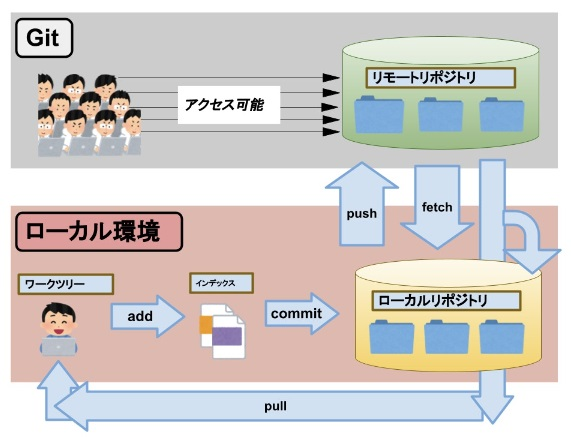
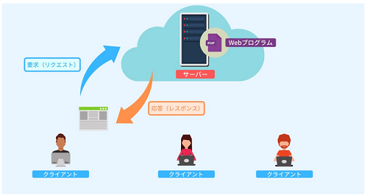
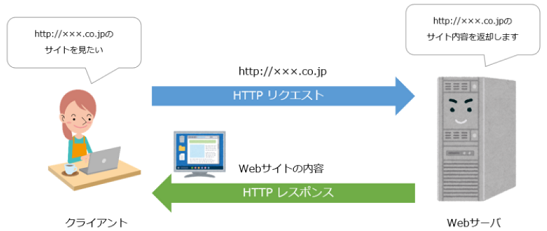
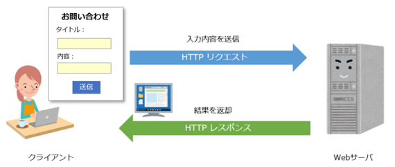

## ① Gitにおけるリモートリポジトリ・ローカルリポジトリとは何か。またその関係性は。

* リモートリポジトリ：共有リポジトリとして複数の開発者がアクセスし、変更の共有および同期を行うためのリポジトリのこと。
* ローカルリポジトリ：開発者が自身のコンピュータ上に作成・保持するリポジトリのこと。
* 関係性
    * ローカルリポジトリでの変更をリモートリポジトリにPushすることで、リモートリポジトリでその変更が反映される。
    * 誰かがリモートリポジトリにPushした変更は、リモートリポジトリからPullすることでローカルリポジトリに反映される。
    * 誰かのローカルリポジトリが破損した場合や、別の環境で作業する必要が出てきた場合、リモートリポジトリからコピーを取得できる。

## ② Gitにおけるワークツリー・インデックス ・リポジトリとは何か。またその関係性は。

* ワークツリー：実際に作業をしている自分のPC内のディレクトリのこと。
* インデックス：「ステージングエリア」とも呼ばれ、ローカルリポジトリにファイルを登録（コミット）する前に一時的に保存する領域のこと。
* リポジトリ：コード、ファイル、各ファイルの変更履歴を格納できる場所のこと。
* 関係性：ワークツリーからインデックスにファイルを登録することを「add」、さらにインデックスからローカルリポジトリに追加することを「commit」と呼び、これらは最終的にリモートリポジトリに統合するための一連の準備である。  

## ③ Gitにおけるブランチとは何か。また、どのような目的で使用するか。

あるプロジェクトから分岐させることで、プロジェクト本体に影響を与えず開発ができる機能のこと。  
ブランチ機能により、お互いの作業に影響を与えることがないため、複数の開発者が同時並行で作業を進められる。

## ④ Gitにおけるプルリクエストとは何か。また、どのような目的で使用するか。

開発者のローカルリポジトリでの変更を、メインのブランチに統合するリクエストのこと。  
機能追加や改修などの変更箇所が同時に表示されるので、チーム内でのコミュニケーションを促進し、コードの品質が向上する。

## ⑤ Gitで以下の操作を行うコマンドは何か。

### 1. ローカルブランチの一覧を表示する。

`git branch`

### 2. リモートブランチの一覧を表示する。

`git branch -r` または `git remote show origin(リモート名)`

### 3. ローカルリポジトリ内のリモートブランチを最新化する。

`git fetch origin(リモート名)`

### 4. 特定のローカルブランチに特定のリモートブランチの差分を反映する。

`git pull "origin(リモート名)" "mainとかmaster(ブランチ名)"`

### 5. 特定のリモートブランチを元に新規ローカルブランチを作成する。

`git checkout -b "新しいブランチ名" "リモート名or既存のブランチ名"`

### 6. 現在作業しているブランチを確認する。

`git branch` または `git status`

### 7. 作業するブランチを切り替える。

`git checkout "mainとかmaster(ブランチ名)"`

### 8. コミット対象ファイル/ディレクトリをインデックス に追加する。

`git add "ファイル名orディレクトリ名"`

### 9. 変更内容をコミットする。

`git commit -m "コミットメッセージ"`

### 10. コミット内容をリモートリポジトリに反映する。

`git push "origin(リモート名)" "mainとかmaster(ブランチ名)"`

## ⑥ HTTPとは何か。

「HyperText Transfer Protocol」の略称で、WebサーバとクライアントのWebブラウザが、データを送受信するためのプロトコル（コンピュータ同士で通信する際、決められた手順や規格のこと）のこと。

## ⑦ HTTPのリクエスト・レスポンスとは何か。またその関係性は。

* リクエスト：クライアントがサーバに対してWebページのデータを要求すること。
* レスポンス：サーバーがクライアントに対してリクエストに対する結果やデータを返すためのメッセージのこと。
* 関係性：下記の通り。
1. クライアントがリクエストをサーバーに送信すると、サーバーはそのリクエストを受け取って処理する。
2. サーバーは処理の結果としてレスポンスを生成し、それをクライアントに送信する。
3. クライアントは受け取ったレスポンスを解釈して、ブラウザにコンテンツを表示したり、アプリケーションで処理する。

## ⑧ HTTPリクエストのGET・POSTとは何か。またその違いは。

* GET：指定されたURLのリソース（Webサイトの内容など）を取り出すメソッド（関数）のこと。  

* POST：クライアントからの入力内容をWebサーバに送信するメソッド（関数）のこと。  

* 違い
  * データの伝送方法：GETはデータをURLの文字列に含めて伝送し、POSTはリクエストボディにデータを格納して伝送する。  
  ※リクエストボディ：HTTPリクエストメッセージの一部であり、クライアントがサーバーに対して送信するデータや情報が格納される領域のこと。
  * データの表示：GETはブラウザのアドレスバーに表示され、ブックマークに保存できるのに対して、POSTはブラウザのアドレスバーには表示されず、直接ブックマークすることが難しい。
  * データの長さ：GETはURLの制限に従ってデータの長さが制約されるのに対して、POSTは制約が緩く、大量のデータを送信できる。
  * 安全性と再実行性：GETはデータがURLに表示されるため、ブラウザの履歴やキャッシュに残りやすく、再実行されやすいのに対して、POSTはデータがリクエストボディに含まれるため、再実行の可能性が低い。

## ⑨ .envファイルとは何か。またどのような目的で使用されるか。

アプリの環境変数を保存するためのファイルのことで、アプリの動作に影響を与える設定や構成の値が格納されている。  
主な目的は下記の通り。
* 機密情報の保護：セキュリティに影響を与える機密情報（APIキー、データベースの接続情報、秘密鍵など）を保存できる。
* 設定の柔軟性：アプリが動作する環境ごとに異なる設定（開発、本番、テストなど）で管理できる。
* 設定の変更が簡単：.envファイルの値を変更するだけで設定を調整でき、データベースの接続先やAPIエンドポイントを切り替える際などに便利。

## ⑩ Laravelにおけるアプリケーションキーとは何か。

アプリケーションのセキュリティや暗号化の際に使用されるランダムな英数字３２文字のこと。「php artisan key:generate」コマンドを実行すると、.env環境ファイルの「APP_KEY」欄に設定される。

## ⑪ Laravelにおけるartisanコマンドとは何か。

CLIの一つで、Webサービスを作る際の設定やコードを簡単なコマンドで実装できるコマンドのこと。

## ⑫ 以下の操作を行うartisanコマンドは何か。

### 1. ポート指定でLaravelアプリケーションを起動する

`php artisan serve --port="ポート番号"`

### 2. コントローラークラスを生成する。

`php artisan make:controller "コントローラークラス名"`
※ コントローラークラス：個々のリクエストに応じた処理を行うクラスのこと。

### 3. モデルクラスを生成する。

`php artisan make:model "モデルクラス名"`
※ モデルクラス：データベースとの連携を行うクラスのこと。