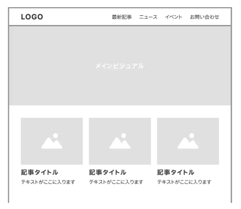
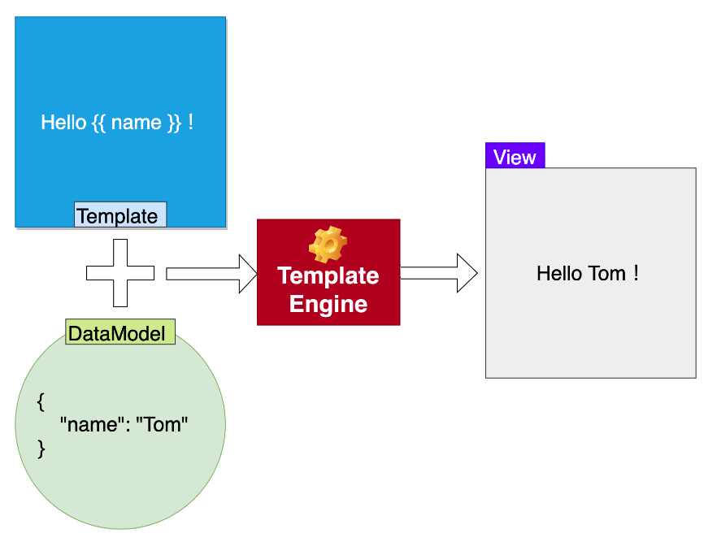

## ① 画面設計におけるワイヤーフレームとは何か。

Webサイトやサービスなどを制作する上で、ページの構成を示す基本的なレイアウト図のこと。特徴は下記の通り。
* 構造がシンプル：デザインの細部や色彩は記載せず、基本的なレイアウトや要素の配置に焦点を当てている。
* 修正しやすい：ザインの変更や機能の追加などが必要なときに修正を加えやすい。
* コンセプトの共有：プロジェクトの初期段階で、チームやクライアントとアイデアやコンセプトを共有する手段として使われる。
* 画面遷移の流れ：ユーザーがどのように情報を閲覧し、サイト内を移動するかなどの流れを確認できる。

## ② LaravelにおけるBladeとは何か。

Laravelフレームワークに組み込まれているテンプレートエンジンのこと。  
LaravelにおけるBladeとは、「テンプレート」と呼ばれるHTMLが埋め込まれたファイルと、「データモデル」と呼ばれるPHPが埋め込まれたファイルを合成して、Webページを生成すること。  
