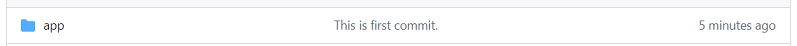

# Git操作

## GitHubでリポジトリを作成

## サーバー側の設定

### blogプロジェクトに移動
#### $ cd ~/blog

### カレントディレクトリに対するGit初期設定
#### $ git init

    Initialized empty Git repository in /home/ec2-user/blog/.git/

### バージョン管理状態を確認
#### $ git status

    On branch master

    No commits yet

    Untracked files:
    (use "git add <file>..." to include in what will be committed)
            .editorconfig
            .env.example
            .gitattributes
            ・
            ・
            ・

### ソース管理されていない全ファイルをステージングに追加
#### $ git add .

### バージョン管理状態を再確認
#### $ git status

    On branch master

    No commits yet

    Changes to be committed:
    (use "git rm --cached <file>..." to unstage)
            new file:   .editorconfig
            new file:   .env.example
            new file:   .gitattributes
            ・
            ・
            ・

### コミットを実行
#### $ git commit -m "This is first commit."

    [master (root-commit) 06327af] This is first commit.
    83 files changed, 11535 insertions(+)
    create mode 100644 .editorconfig
    create mode 100644 .env.example
    create mode 100644 .gitattributes
    ・
    ・
    ・

### リモートリポジトリの設定
#### $ git remote add origin git@github.com:ユーザ名/リポジトリ名.git

### リモートリポジトリへの反映
#### $ git push origin master
※下記のように先ほど設定したコメントが表示されていればOK。  
