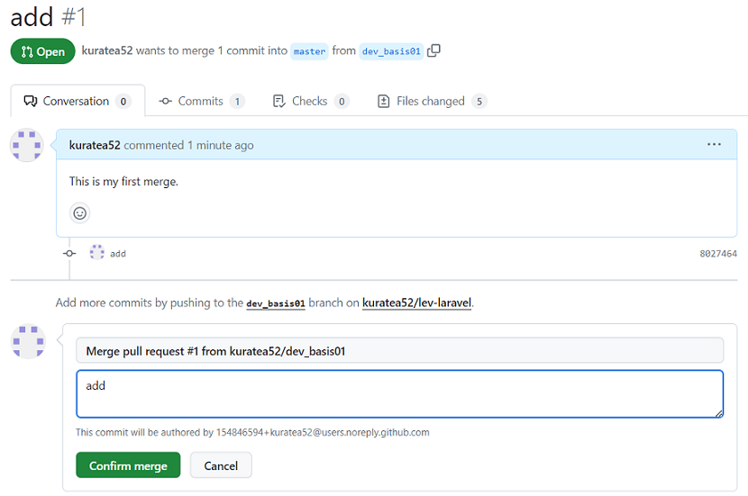

# GitHubへの反映

## GitHubへのプッシュ

### 作成・変更したファイルのインデックス追加
#### $ git status
※ 作成・変更したファイルがインデックスに追加されていないことを確認

    On branch dev_basis01
    Your branch is up to date with 'origin/master'.

    Changes not staged for commit:
    (use "git add <file>..." to update what will be committed)
    (use "git restore <file>..." to discard changes in working directory)
            modified:   config/app.php
            modified:   routes/web.php

    Untracked files:
    (use "git add <file>..." to include in what will be committed)
            app/Http/Controllers/PostController.php
            app/Models/Post.php
            database/migrations/2024_01_15_125135_create_posts_table.php

    no changes added to commit (use "git add" and/or "git commit -a")

### 作成・変更したファイルをまとめてインデックスに追加
#### $ git add .

### 作成・変更したファイルがインデックスに追加されたことを確認
#### $ git status

    On branch dev_basis01
    Your branch is up to date with 'origin/master'.

    Changes to be committed:
    (use "git restore --staged <file>..." to unstage)
            new file:   app/Http/Controllers/PostController.php
            new file:   app/Models/Post.php
            modified:   config/app.php
            new file:   database/migrations/2024_01_15_125135_create_posts_table.php
            modified:   routes/web.php

### インデックスに追加された内容をコミット
#### $ git commit -m "適切なコミットコメント"

    [dev_basis01 8027464] add
    5 files changed, 72 insertions(+), 1 deletion(-)
    create mode 100644 app/Http/Controllers/PostController.php
    create mode 100644 app/Models/Post.php
    create mode 100644 database/migrations/2024_01_15_125135_create_posts_table.php

### コミットされたファイル/ディレクトリがインデックスに表示されないことを確認
#### $ git status

    On branch dev_basis01
    Your branch is ahead of 'origin/master' by 1 commit.
    (use "git push" to publish your local commits)

    nothing to commit, working tree clean

### GitHubへのプッシュ
#### $ git push origin dev_basis01
※ リモートリポジトリへdev_basis01ブランチがプッシュされる

    Enumerating objects: 26, done.
    Counting objects: 100% (26/26), done.
    Compressing objects: 100% (15/15), done.
    Writing objects: 100% (15/15), 2.06 KiB | 526.00 KiB/s, done.
    Total 15 (delta 7), reused 0 (delta 0), pack-reused 0
    remote: Resolving deltas: 100% (7/7), completed with 7 local objects.
    remote: 
    remote: Create a pull request for 'dev_basis01' on GitHub by visiting:
    remote:      https://github.com/kuratea52/lev-laravel/pull/new/dev_basis01
    remote: 
    To github.com:kuratea52/lev-laravel.git
    * [new branch]      dev_basis01 -> dev_basis01

## GitHub上でのブランチマージ

### GitHubからリモートリポジトリを開き、「Compare & pull request」をクリック

### マージ元がdev_basis01、マージ先がmasterとなっていることを確認

### タイトルとコメントを入力

### 「Create pull request」をクリック

### 「Merge pull request」をクリック

