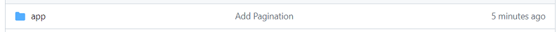

# GitHubへの反映

## GitHub上でのブランチマージ

### GitHubからリモートリポジトリを開き、「Compare & pull request」をクリック

### マージ元がdev_basis02、マージ先がmasterとなっていることを確認

### タイトルとコメントを入力

### 「Create pull request」をクリック

### 「Merge pull request」をクリック

### 「Confirm merge」をクリック