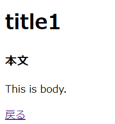

# ブログ投稿詳細画面の作成

## show.blade.php

### 「blog/resources/views/posts」配下に、show.blade.phpを作成して下記を記載

    <!DOCTYPE HTML>
    <html lang="{{ str_replace('_', '-', app()->getLocale()) }}">
        <head>
            <meta charset="utf-8">
            <meta name="viewport" content="width=device-width, initial-scale=1">
            <title>Posts</title>
            <!-- Fonts -->
            <link href="https://fonts.googleapis.com/css?family=Nunito:200,600" rel="stylesheet">
        </head>
        <body>
            <h1 class="title">
                {{ $post->title }}
            </h1>
            

                

                    <h3>本文</h3>
                    
{{ $post->body }}
    
                

            

            

                <a href="/">戻る</a>
            

        </body>
    </html>

## Routing

### 「blog/routes」配下にあるweb.phpに、下記を追加

    // '/posts/{対象データのID}'にGetリクエストが来たら、PostControllerのshowメソッドを実行する。
    Route::get('/posts/{post}', [
        PostController::class,
        'show'
    ]);

## Controller

### 「blog/app/Http/Controllers」配下にあるPostController.phpにブログ投稿詳細画面表示用のshow関数を追加

    public function show(Post $post)
    {
        return view('posts.show')->with(['post' => $post]);
    //'post'はbladeファイルで使う変数。中身は$postはid=1のPostインスタンス。
    }

### アプリを起動して、修正内容が反映されていることを確認
#### $ php artisan serve --port=8080
※ URLの末尾に「/posts/1」を追記して開くと下記のような画面になる。  
