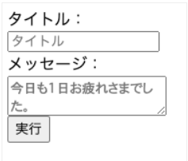
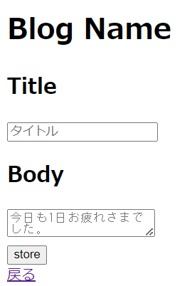

# ブログ投稿作成画面の作成

## ブログ投稿作成画面用Viewファイル作成
※ 完成イメージは下記の通り。  

### Form領域を準備する
※ 「blog/resources/views/posts」配下に、create.blade.phpを作成して下記を記載する。

    <!DOCTYPE HTML>
    <html lang="{{ str_replace('_', '-', app()->getLocale()) }}">
        <head>
            <meta charset="utf-8">
            <title>Blog</title>
        </head>
        <body>
            <h1>Blog Name</h1>
            <!-- action属性はフォームが送信されたときにデータが送信される先のURLを指定している。 -->
            <!-- method属性はフォームデータの送信方法を指定しており、データがURLに直接表示されないようにPOSTリクエストを指定する。 -->
            <form action="/posts" method="POST">
                <!-- CSRFというセキュリティ脅威からアプリを守るため、Formタグの内側に「@csrf」と挿入する。 -->
                @csrf
                

                    <h2>Title</h2>
                    <!-- 改行が不要で選択肢が不要なフリーテキストタイプは、type属性にtextを使用する。 -->
                    <!-- name属性でフォームに名前をつけ、入力内容をその名前の配列として格納できる。 -->
                    <!-- 開始タグの最後を「/>」と記載すると、終了タグを省略できる。 -->
                    <input type="text" name="post[title]" placeholder="タイトル"/>
                

                

                    <h2>Body</h2>
                    <!-- 改行が可能で選択肢が不要なフリーテキストタイプは、type属性にtextareaを使用する。 -->
                    <textarea name="post[body]" placeholder="今日も1日お疲れさまでした。"></textarea>
                

                <!-- Form領域の送信を実行するときは、type属性にsubmitを使用する。 -->
                <input type="submit" value="store"/>
            </form>
            

                <a href="/">戻る</a>
            

        </body>
    </html>

## ブログ投稿一覧画面へのブログ投稿作成画面表示用導線追加
※ 「blog/resources/views/posts」配下にある、index.blade.phpに下記を追加する。

    <a href='/posts/create'>create</a>

## ブログ投稿作成画面表示用ルーティングの追加
※ 「blog/routes」配下にある、web.phpに下記を追加する。
※ 必ず`Route::get('/posts/{post}', [PostController::class,'show']);`の上に書く。

    Route::get('/posts/create', [PostController::class, 'create']);

## ブログ投稿作成画面表示用のコントローラー実装
※ 「blog/app/Http/Controllers」配下にある、PostController.phpに下記を追加する。

    public function create()
    {
        return view('posts.create');
    }

### アプリを起動して、修正内容が反映されていることを確認
#### $ php artisan serve --port=8080
※ URLの末尾に「/posts/」を追記したら、表示されたページの「create」をクリックして下記のような画面が表示されたらOK。
※ また、戻るをクリックして一覧画面に戻ったらOK。    

### 一旦Gitにコミットする
#### $ git status
#### $ git add .
#### $ git status
#### $ git commit -m "Create Blog Post Form"
#### $ git status
#### $git push origin dev_basis04