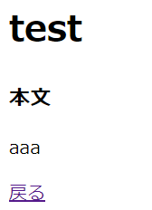

# ブログ投稿作成画面の保存処理実装

## ブログ投稿作成実行用ルーティングの追加
### 「blog/routes」配下にある、web.phpに下記を追加する。
※ POSTリクエストが/postsパスに送信されたら、PostControllerのstoreメソッドを呼び出すように設定した。

    Route::post('/posts', [PostController::class, 'store']);

## ブログ投稿作成処理用のコントローラー実装
### 「blog/app/Http/Controllers」配下にある、PostController.phpに下記を追加する。

    // $requestはデフォルトで用意されているIlluminate\Http\Requestクラスのインスタンス
    // $postはPostクラスのインスタンス、入力内容をデータベースとやりとりするために用意したので空の状態
    public function store(Request $request, Post $post)
    {
        // create.blade.phpにある、postをキーに持つパラメータを取得する。
        $input = $request['post'];
        // Modelクラスを継承したPostクラスにはfillメソッドが元々用意されており、$input（入力内容がリストになって格納されている）を引数にして内容を保存するという処理を$postに代入した。
        $post->fill($input)->save();
        // idは、$postによってモデルクラスからデータベースに保存された入力内容に順番に番号を振ったものでｍ「/posts/1」や「/posts/2」などのように、「/posts/」と、このidを、ドットで連結したURLを返している。
        return redirect('/posts/' . $post->id);
    }

## ブログ投稿作成処理用のモデル実装
### 「blog/app/Models」配下にある、Post.phpのPostクラス内に下記を追加する。
※ fillメソッドとは、複数のプロパティに対応した値を一度にセットできる関数のことで、フォームからの入力項目を格納するときに使用する。
※ fillabeleメソッドを追加することで、fillメソッドが可能なプロパティを指定できる。

    protected $fillable = [
        'title',
        'body',
    ];

### アプリを起動して、修正内容が反映されていることを確認
#### $ php artisan serve --port=8080
※ URLの末尾に「/posts/」を追記したら、表示されたページの「create」をクリックしてTitleとBodyを入力してstoreをクリックする。
※ ページが下記画像のように遷移され、URLが下記画像のようになっていたらOK。  

### データベースで入力内容が保存されているか確認
#### $ mysql -u dbuser -p blog

    +----+---------+-----------------+---------------------+---------------------+------------+
    | id | title   | body            | created_at          | updated_at          | deleted_at |
    +----+---------+-----------------+---------------------+---------------------+------------+
    |  1 | title1  | This is body.   | 2024-01-12 12:29:21 | 2024-01-12 12:29:21 | NULL       |
    |  2 | title2  | This is body2.  | 2024-01-12 12:50:05 | 2024-01-12 12:50:05 | NULL       |
    |  3 | title3  | This is body3.  | 2024-01-16 12:32:11 | 2024-01-16 12:32:11 | NULL       |
    |  4 | title4  | This is body4.  | 2024-01-16 13:50:56 | 2024-01-16 13:50:56 | NULL       |
    |  5 | title5  | This is body5.  | 2024-01-16 13:50:56 | 2024-01-16 13:50:56 | NULL       |
    |  6 | title6  | This is body6.  | 2024-01-16 13:50:56 | 2024-01-16 13:50:56 | NULL       |
    |  7 | title7  | This is body7.  | 2024-01-16 13:50:56 | 2024-01-16 13:50:56 | NULL       |
    |  8 | title8  | This is body8.  | 2024-01-16 13:50:56 | 2024-01-16 13:50:56 | NULL       |
    |  9 | title9  | This is body9.  | 2024-01-16 13:50:56 | 2024-01-16 13:50:56 | NULL       |
    | 10 | title10 | This is body10. | 2024-01-16 13:50:56 | 2024-01-16 13:50:56 | NULL       |
    | 11 | title11 | This is body11. | 2024-01-16 13:50:56 | 2024-01-16 13:50:56 | NULL       |
    | 12 | title12 | This is body12. | 2024-01-16 13:50:56 | 2024-01-16 13:50:56 | NULL       |
    | 13 | title13 | This is body13. | 2024-01-16 13:50:56 | 2024-01-16 13:50:56 | NULL       |
    | 14 | title14 | This is body14. | 2024-01-16 14:03:27 | 2024-01-16 14:03:27 | NULL       |
    | 15 | title15 | This is body15. | 2024-01-16 14:03:27 | 2024-01-16 14:03:27 | NULL       |
    | 16 | title16 | This is body16. | 2024-01-16 14:03:27 | 2024-01-16 14:03:27 | NULL       |
    | 17 | test    | aaa             | 2024-01-18 15:11:05 | 2024-01-18 15:11:05 | NULL       |
    +----+---------+-----------------+---------------------+---------------------+------------+
    17 rows in set (0.000 sec)