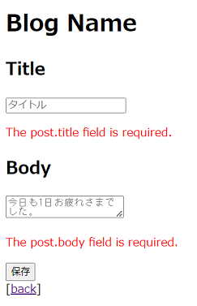
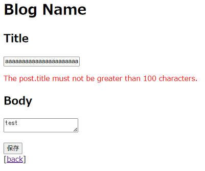

# ブログ投稿作成画面の保存時入力チェック処理実装

## ブログ投稿用リクエストクラス作成
### FormRequestを継承したPostRequestクラスを作成する
#### $ php artisan make:request PostRequest

    INFO  Request [app/Http/Requests/PostRequest.php] created successfully.

#### $ ls ~/blog/app/Http/Requests/ -l
※ PostRequest.phpが生成されたことを確認する。

    -rw-rw-r-- 1 ec2-user ec2-user 500 Jan 18 15:29 PostRequest.php

## ブログ投稿用リクエストクラス修正
### 「blog/app/Http」配下にある、PostRequest.phpを下記のように修正

    <?php

    namespace App\Http\Requests;

    use Illuminate\Foundation\Http\FormRequest;

    class PostRequest extends FormRequest
    {
        public function rules()
        {
            return [
                // キー名はHTML上Formのname属性のこと。post[title]など入れ子になっている場合は.（ドット）で繋ぐ。
                // ルールが複数ある場合は|（パイプ）で繋げる。
                // ルールは左側から評価され、エラーがあった段階で返却される。
                // required|string|max:100 → 入力が空でないこと・文字列であること・１００文字以内であること
                'post.title' => 'required|string|max:100',
                'post.body' => 'required|string|max:4000'
            ];
        }
    }

## コントローラー修正
### 「blog/app/Http/Controllers」配下にある、PostController.phpを下記のように修正
※ 先ほどのルールを適用するために、RequestクラスをPostRequestクラスに変更する。

    <?php

    namespace App\Http\Controllers;

    use App\Models\Post;
    use App\Http\Requests\PostRequest; // useする

    class PostController extends Controller
    {
        public function index(Post $post)
        {
            return view('posts.index')->with(['posts' => $post->getPaginateByLimit()]);
        }

        public function show(Post $post)
        {
            return view('posts.show')->with(['post' => $post]);
        }

        public function create()
        {
            return view('posts.create');
        }

        public function store(Post $post, PostRequest $request) // 引数をRequestからPostRequestにする
        {
            $input = $request['post'];
            $post->fill($input)->save();
            return redirect('/posts/' . $post->id);
        }
    }

## ビュー修正
### blog/resources/views/posts」配下にあるcreate.blade.phpを下記のように修正して、バリデーションエラーメッセージを表示させる

    <!DOCTYPE HTML>
    <html lang="{{ str_replace('_', '-', app()->getLocale()) }}">
        <head>
            <meta charset="utf-8">
            <title>Blog</title>
        </head>
        <body>
            <h1>Blog Name</h1>
            <form action="/posts" method="POST">
                @csrf
                

                    <h2>Title</h2>
                    <!-- value属性を「"{{ old('post.title') }}"」とすることでエラーの直前に入力されていたデータを保持できる。 -->
                    <!-- oldは、セッションに保存された前回のリクエストデータを取得するデフォルト関数のこと。 -->
                    <input type="text" name="post[title]" placeholder="タイトル" value="{{ old('post.title') }}"/>
                    <!-- $errorsに最初のエラーメッセージを取得するデフォルトメソッドを代入している。 -->
                    
{{ $errors->first('post.title') }}

                

                

                    <h2>Body</h2>
                    <textarea name="post[body]" placeholder="今日も1日お疲れさまでした。">{{ old('post.body') }}</textarea>
                    
{{ $errors->first('post.body') }}

                

                <input type="submit" value="保存"/>
            </form>
            
[<a href="/">back</a>]

        </body>
    </html>

### アプリを起動して、修正内容が反映されていることを確認
#### $ php artisan serve --port=8080
※ URLの末尾に「/posts/」を追記したら、表示されたページの「create」をクリックして、何も記入しなかった場合は下記画像のようなエラーが出たらOK。  
※ 同様の画面で、Titleに１００文字以上、Bodyに任意の文字を入力して、Titleに下記画像のようなエラーが出たらOK。  
※ さらに、エラーが出た後でも、Bodyには入力した文字が残っていればOK。  

### 一旦Gitにコミットする
#### $ git status
#### $ git add .
#### $ git status
#### $ git commit -m "Implementation of Validation"
#### $ git status
#### $git push origin dev_basis04