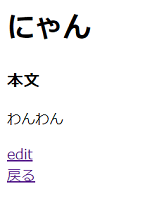

# ブログ投稿編集画面の作成

## ブログ投稿編集関連のルーティング追加
### 「blog/routes」配下にある、web.phpに下記を追加する。

    Route::get('/posts/{post}/edit', [PostController::class, 'edit']);
    Route::put('/posts/{post}', [PostController::class, 'update']);

## ブログ投稿編集画面表示用のコントローラー実装
### 「blog/app/Http/Controllers」配下にある、PostController.phpに下記を追加する。

    public function edit(Post $post)
    {
        return view('posts.edit')->with(['post' => $post]);
    }

## ブログ投稿編集実行用のコントローラー実装
### 「blog/app/Http/Controllers」配下にある、PostController.phpに下記を追加する。

    public function update(PostRequest $request, Post $post)
    {
        $input_post = $request['post'];
        $post->fill($input_post)->save();

        return redirect('/posts/' . $post->id);
    }

## ブログ投稿編集画面のViewファイル作成
### 「blog/resources/views/posts」配下に、edit.blade.phpを作成して下記のように記述する。

    <!-- body内だけを表示している。 -->
    <body>
        <h1 class="title">編集画面</h1>
        

            <form action="/posts/{{ $post->id }}" method="POST">
                @csrf
                @method('PUT')
                

                    <h2>タイトル</h2>
                    <input type='text' name='post[title]' value="{{ $post->title }}">
                

                

                    <h2>本文</h2>
                    <input type='text' name='post[body]' value="{{ $post->body }}">
                

                <input type="submit" value="保存">
            </form>
        

    </body>

## ブログ投稿詳細画面へのブログ投稿編集画面表示用導線追加
### 「blog/resources/views/posts」配下にある、show.blade.phpに下記を追加する。

    
<a href="/posts/{{ $post->id }}/edit">edit</a>

### アプリを起動して、修正内容が反映されていることを確認
#### $ php artisan serve --port=8080
※ ブログ投稿一覧の詳細画面に遷移し、「edit」ボタンから内容を変更したあと、「保存」をクリックして内容が変更されていればOK。  

### 一旦Gitにコミットする
#### $ git status
#### $ git add .
#### $ git status
#### $ git commit -m "Edit Blog Post"