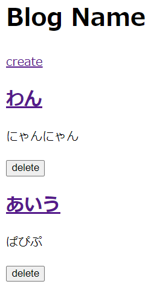
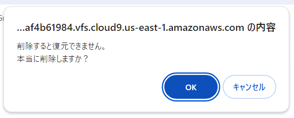
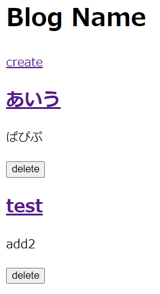

# ブログ投稿の削除処理実装

## ブログ投稿削除関連のルーティング追加
### 「blog/routes」配下にある、web.phpに下記を追加する。

    // '/posts/{対象データのID}'にDeleteリクエストが来たら、PostController.phpのdeleteメソッドを実行する。
    Route::delete('/posts/{post}', [PostController::class,'delete']);

## ブログ投稿削除実行用のコントローラー実装
### 「blog/app/Http/Controllers」配下にある、PostController.phpに下記を追加する。

    public function delete(Post $post)
    {
        $post->delete();
        return redirect('/posts');
    }

## ブログ投稿一覧画面へのブログ投稿削除実行用導線追加
### 「blog/resources/views/posts」配下にある、index.blade.phpに下記を追加する。
※ pタグの下に書く。deleteボタンを作っている。

    <form action="/posts/{{ $post->id }}" id="form_{{ $post->id }}" method="post">
        @csrf
        @method('DELETE')
        <button type="button" onclick="deletePost({{ $post->id }})">delete</button> 
    </form>

### 「blog/resources/views/posts」配下にある、index.blade.phpに下記を追加する。
※ bodyの閉じタグの上に書く。

    

## ブログ投稿用モデルクラス修正
### 「blog/app/Models」配下にある、Post.phpに下記を追加する。
※ class定義より前のuse定義に書く。

    use Illuminate\Database\Eloquent\SoftDeletes;

### 「blog/app/Models」配下にある、Post.phpに下記を追加する。
※ class定義直後のuse定義に書く。

    use SoftDeletes;

### アプリを起動して、修正内容が反映されていることを確認
#### $ php artisan serve --port=8080
* ブログ投稿一覧にそれぞれ「delete」ボタンが追加されたことを確認する。  
* 「delete」をクリックすると、削除したら復元できないという旨のポップアップが表示されることを確認する。  
* 「OK」をクリックして一覧画面に戻ると、削除した項目が消されていることを確認する。  
 →  → 

### アプリ上で削除したデータは、データベース上でどうなっているか確認
#### $ mysql -u dbuser -p blog
#### MariaDB [blog]> select * from posts;
※ deleted_at列に削除時刻が追加されていることを確認する。

    +----+-----------+--------------------+---------------------+---------------------+---------------------+
    | id | title     | body               | created_at          | updated_at          | deleted_at          |
    +----+-----------+--------------------+---------------------+---------------------+---------------------+
    |  1 | title1    | This is body.      | 2024-01-12 12:29:21 | 2024-01-12 12:29:21 | NULL                |
    |  2 | title2    | This is body2.     | 2024-01-12 12:50:05 | 2024-01-12 12:50:05 | NULL                |
    |  3 | title3    | This is body3.     | 2024-01-16 12:32:11 | 2024-01-16 12:32:11 | NULL                |
            ・
            ・
            ・
    | 20 | test      | add2               | 2024-01-18 17:15:25 | 2024-01-19 10:55:16 | NULL                |
    | 21 | あいう    | ぱぴぷ             | 2024-01-19 11:05:36 | 2024-01-19 13:29:54 | 2024-01-19 13:29:54 |
    | 22 | わん      | にゃんにゃん       | 2024-01-19 11:07:45 | 2024-01-19 13:28:26 | 2024-01-19 13:28:26 |
    +----+-----------+--------------------+---------------------+---------------------+---------------------+
    22 rows in set (0.000 sec)

### 一旦Gitにコミットする
#### $ git status
#### $ git add .
#### $ git status
#### $ git commit -m "Implementing Blog Post Deletion Process"