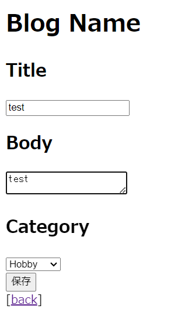
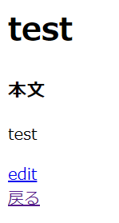
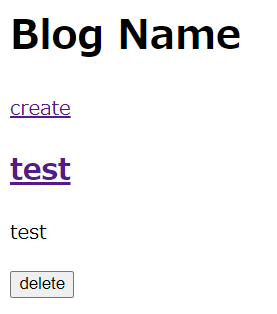

# ブログ投稿作成画面で、カテゴリーを選べるようにする

## 新規投稿作成画面でカテゴリーを選択できるようにする

### 「blog/app/Http/Controllers」配下にあるPostController.phpに、下記を追加してViewファイルにカテゴリーのデータを渡す。
※ createメソッドに元々あったコードは一旦削除する。

    use App\Models\Category;

    public function create(Category $category)
    {
        return view('posts.create')->with(['categories' => $category->get()]);
        // Viewファイル「create」内のcategories変数に、
        // Categoryモデルから生成されたcategoryインスタンスのgetメソッド（すべてのカテゴリを取得）を処理した値を格納する。
    }

### 「blog/resources/views/posts」配下にあるcreate.blade.phpに、下記を追加して実際のページにカテゴリー選択ボタンを表示させる。
※ 本文入力欄の下に作成する。

    

        <h2>Category</h2>
        <select name="post[category_id]">
            <!--@foreach($categories as $category)   $categoriesには、categoriesテーブルのデータが入っている-->
                <option value="{{ $category->id }}">{{ $category->name }}</option>
            @endforeach
        </select>
    

## category_idを保存する処理

### 「blog/app/Models」配下にあるPost.phpを、下記のように変更する。
※ selectタグのname属性で定義したcategory_idを$fillableに追加することで、データベースにfillメソッドでcategory_idを保存できるようになる。

    //変更前
    protected $fillable = [
        'title',
        'body'
    ];

    //変更後
    protected $fillable = [
        'title',
        'body',
        'category_id'   // 追加する。
    ];

## アプリを起動して、修正内容が反映されていることを確認

#### $ php artisan serve --port=8080
* トップページにはタイトルとcreateボタンだけ  
  
* 「create」をクリックすると投稿画面に遷移  
  
* カテゴリー欄が追加されていることを確認して投稿 → 投稿内容を表示する画面に遷移  
  
* 「戻る」をクリックしてトップページに遷移すると投稿内容が表示されている  

## データベースの確認

### MariaDBにログインしてpostsテーブルに投稿データが保存されているか確認する。
#### $ mysql -u dbuser -p blog
#### MariaDB [blog]> SELECT * FROM posts;
※ category_idカラムには、id=1（Hobby）が登録されている。

    +----+-------+------+---------------------+---------------------+------------+-------+-------------+
    | id | title | body | created_at          | updated_at          | deleted_at | image | category_id |
    +----+-------+------+---------------------+---------------------+------------+-------+-------------+
    |  1 | test  | test | 2024-01-22 13:35:36 | 2024-01-22 13:35:36 | NULL       | NULL  |           1 |
    +----+-------+------+---------------------+---------------------+------------+-------+-------------+
    1 row in set (0.000 sec)

## 一旦Gitにコミットする

#### $ git status
#### $ git add .
#### $ git status
#### $ git commit -m "Enable category selection on the blog post creation screen"