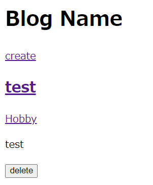
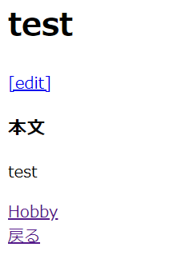

# ブログにカテゴリー名を表示する

## カテゴリー名の表示

### 「blog/app/Models」配下にあるPost.phpを下記のように修正する。

    //変更前
    function getPaginateByLimit(int $limit_count = 5)
    {
        return $this->orderBy('updated_at', 'DESC')->paginate($limit_count);
    }

    //変更後
    function getPaginateByLimit(int $limit_count = 5)
    {
        return $this::with('category')->orderBy('updated_at', 'DESC')->paginate($limit_count);
        // 「$this::with('category')」で、postsテーブルに関連するcategoriesテーブルを取得する。
    }

### 「blog/resources/views/posts」配下にあるindex.blade.php・show.blade.phpに、下記を追記する。
※ index（トップページ）にはタイトルの下、show（投稿詳細ページ）には本文の下にそれぞれ追記する。
※ showのeditボタンを、見やすくするためにタイトル下に来るよう位置変更した。

    <a href="">{{ $post->category->name }}</a>
    // $postはPostモデルのインスタンス、つまりPostモデルのcategoryメソッドを使ってnameカラムを呼び出している。
    // categoryメソッドはcategoriesテーブルのデータを引っ張って来る関数。

## アプリを起動して、修正内容が反映されていることを確認

#### $ php artisan serve --port=8080
トップページの投稿タイトルの下にカテゴリー欄が追加された。  
  
投稿詳細画面に遷移すると、戻るボタンの上にカテゴリー欄が追加された。  

## 一旦Gitにコミットする

#### $ git status
#### $ git add .
#### $ git status
#### $ git commit -m "Displaying Category Name"