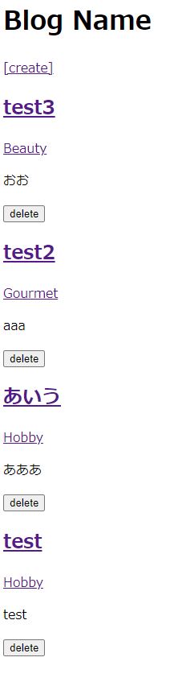
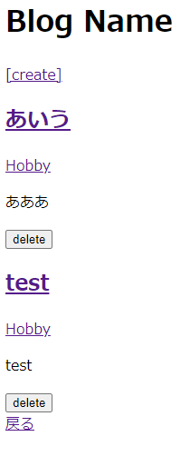

# カテゴリーごとの投稿一覧表示をする

## ルーティングの設定

### 「blog/routes配下にあるweb.phpに、下記を追加してルーティング設定をする。
※ ルートから、「posts/」を経由せずに「/categories/{category}」と飛ぶようにする。

    use App\Http\Controllers\CategoryController;

    Route::get('/categories/{category}', [CategoryController::class,'index']);

## ルーティングで設定したCategoryControllerファイルを作成する。

### 「blog/app/Http/Controllers」配下にCategoryController.phpを作成し、下記を記載する。

    <?php

    namespace App\Http\Controllers;

    use App\Models\Category;

    class CategoryController extends Controller
    {
        public function index(Category $category)
        {
            return view('categories.index')->with(['posts' => $category->getByCategory()]);
        }
    }
    ?>

## Categoryモデルに、自身に属する投稿を取得する処理を追加

### 「blog/app/Models」配下にあるCategory.phpに、下記を追加する。
※ コントローラークラス内のCategoryモデルをここで定義している。

    public function getByCategory(int $limit_count = 5)
    {
        return $this->posts()->with('category')->orderBy('updated_at', 'DESC')->paginate($limit_count);
        // $thisインスタンスを通してCategoryクラスにアクセスする。postsメソッドにはhasManyがあることでリレーションの関係になり、さらにwithメソッドでpostsテーブルに関連したcategoriesテーブルのデータを呼び出している。
    }

## ルーティングに対応したviewファイルの準備

### 「blog/resources/views/posts」配下にある、index.blade.phpとshow.blade.phpに下記を追加する。
※ カテゴリー名をクリックしたら「/categories/{カテゴリー名}」のページに飛ぶように設定する。

    <a href="/categories/{{ $post->category->id }}">{{ $post->category->name }}</a>

### 「blog/resources/views/categories」配下にもindex.blade.phpを作成し、posts配下にあるindex.blade.phpと同じ内容を追加する。
※ ルーティング設定で、CategoryControllerのindexメソッドを定義している。indexメソッドには、categories配下のindexファイルを表示させるように命令があり、つまり「/categories/{カテゴリー名}」にGETリクエストが来たら表示される画面を作成している。

## アプリを起動して、修正内容が反映されていることを確認

#### $ php artisan serve --port=8080
トップ画面には、一覧が表示されている。  
  
例えばカテゴリー「Hobby」をクリックすると、Hobbyだけに絞られた画面に変わる。  
  
この時、URLは「/categories/1」、つまりHobbyのid=1となっている。  

## 一旦Gitにコミットする

#### $ git status
#### $ git add .
#### $ git status
#### $ git commit -m "Displaying Posts by Category"