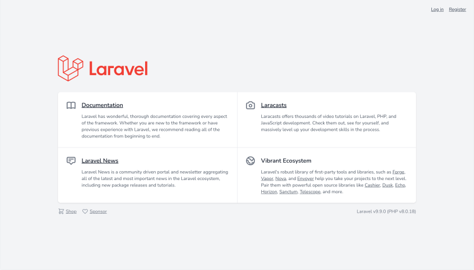
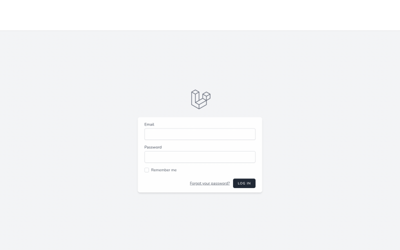
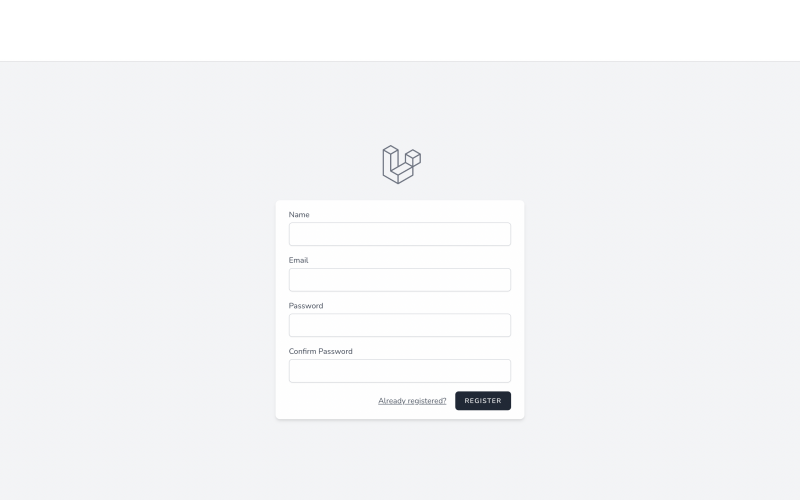
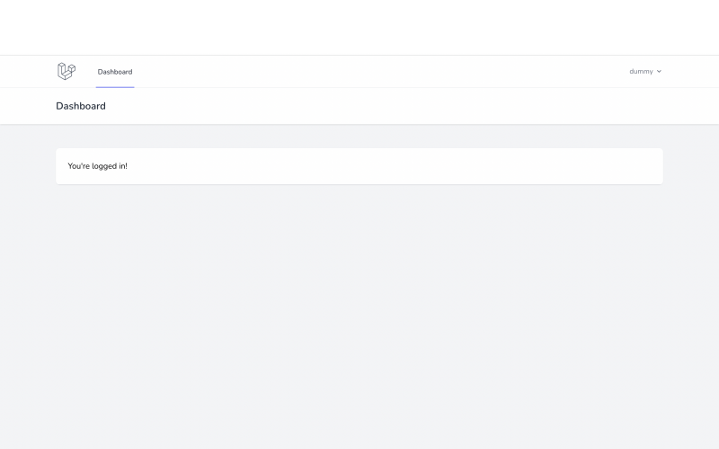
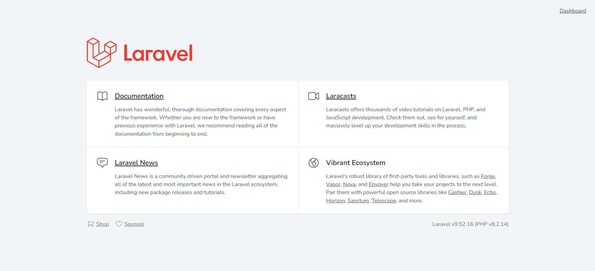

# 認証機能の実装・ログイン認証後のページ変更

## Laravel/Breezeのインストール

### blogディレクトリに移動後、下記コマンドを実行してLaravel/Breezeパッケージをblogプロジェクトに追加する。
#### $ composer require laravel/breeze --dev

### 続けて下記コマンドを実行し、Breeze機能をインストールする。
#### $ php artisan breeze:install blade

    INFO  Breeze scaffolding installed successfully.

## コンパイル

### CSSのファイルを利用できるようにするために、下記コマンドを実行する。
#### $ npm install && npm run build
※ 「プロジェクトのpackage.jsonファイルに記載された依存関係をインストールし、成功したらscriptsセクションに定義されたbuildスクリプトを実行する」という意味。

    ✓ built in 4.15s

## URLのhttps化

### ログインできないことを確認する。
※ アプリケーションを起動して、URLを「/login」にするとログイン画面が表示されるが、URLがhttpの状態（今までのblogプロジェクト）だとログイン処理がうまくいかないので、httpsに変える。

### 「blog/app/Providers」配下にあるAppServiceProvider.phpの、bootメソッドに下記を追加する。
※ アプリケーション内で生成されるURLのスキームをHTTPSに設定している。またbootメソッド内の２行目は、ウェブサーバーからアプリケーションにHTTPリクエストが渡される際に、HTTPSを「on」にセットするコード。

    public function boot()
    {
        \URL::forceScheme('https');
        $this->app['request']->server->set('HTTPS','on');
    }

## アプリを起動して、修正内容が反映されていることを確認

#### $ php artisan serve --port=8080

* 起動後、以下の画面が表示される。

* 右上の「Login」を押す、またはURLを/loginにすると、以下のようなログイン認証画面が表示される。

* 起動画面に戻って、今度は右上の「Register」を押す、またはURLを/registerにすると、以下のような登録画面が表示される。

* 認証情報の登録が完了したら、登録後に以下のページに遷移する。

* URLを「/dashboard」に「/」にすると、右上に「Dashboard」と表示された最初の画面に戻る。

## データベースの確認

### MariaDBにログインしてusersテーブルに登録したユーザー情報が入っていることを確認する。
#### $ mysql -u dbuser -p blog
#### MariaDB [blog]> 

    +----+-----------+---------------------+-------------------+--------------------------------------------------------------+--------------------------------------------------------------+---------------------+---------------------+
    | id | name      | email               | email_verified_at | password                                                     | remember_token                                               | created_at          | updated_at          |
    +----+-----------+---------------------+-------------------+--------------------------------------------------------------+--------------------------------------------------------------+---------------------+---------------------+
    |  1 | kuratea52 | yasaimogu@gmail.com | NULL              | $2y$10$DPsma5VYYopTYR1n7CjGkuVxO1QSihS1XV9IafPK.s675RhKMNEgO | 7RbgOpFy3cNno0e2PNhRF1jPVaSdYxHVHiJEDjeyAjYK2Sk2KoUN2JbmNz89 | 2024-01-23 11:19:17 | 2024-01-23 11:19:17 |
    +----+-----------+---------------------+-------------------+--------------------------------------------------------------+--------------------------------------------------------------+---------------------+---------------------+
    1 row in set (0.000 sec)