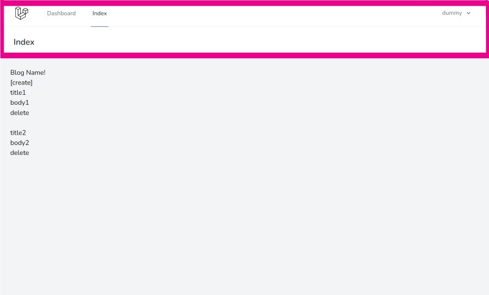

# ログアウト機能の実装

## ビューの継承

### Viewファイルを修正して、Laravel Breezeの親ビューの継承を実装する。
※ 下記は、「blog/resources/views/posts」配下にあるindex.blade.phpの修正例である。

    <x-app-layout>
        <x-slot name="header">
            <h2 class="font-semibold text-xl text-gray-800 leading-tight">
                Index
            </h2>
        </x-slot>
        
        <h1>Blog Name</h1>
        <a href='/posts/create'>[create]</a>
        

            <!-- $postsに含まれる値を反復処理 -->
            @foreach ($posts as $post)
            

                <!-- bladeファイル内で変数を扱う場合は{\{ $変数名 }}という形で記載 -->
                <h2 class='title'>
                    <a href="/posts/{{ $post->id }}">{{ $post->title }}</a>
                </h2>
                <a href="/categories/{{ $post->category->id }}">{{ $post->category->name }}</a>
                
{{ $post->body }}

                <form action="/posts/{{ $post->id }}" id="form_{{ $post->id }}" method="post">
                    @csrf
                    @method('DELETE')
                    <button type="button" onclick="deletePost({{ $post->id }})">delete</button> 
                </form>
            

            @endforeach
        

        

            {{ $posts->links() }}
        

        
    </x-app-layout>

## ナビゲーションの修正

### 「blog/resources/views/layouts」配下にある、navigation.blade.phpを下記のように修正して、Indexという名前でナビゲーションを追加する。

    <x-nav-link :href="route('dashboard')" :active="request()->routeIs('dashboard')">
        {{ __('Dashboard') }}
    </x-nav-link>
    <x-nav-link :href="route('index')" :active="request()->routeIs('index')">
        {{ __('Index') }}
    </x-nav-link>

## 名前付きルート

### 「blog/routes」配下にあるweb.phpに下記を追加して、ルーティングにname('name名')を付与して、ルートの名前を指定する。

    use App\Http\Controllers\PostController;

    Route::get('/', [PostController::class, 'index'])->name('index');
    // URL「/」にアクセスしたらPostControllerクラスのIndexメソッドが呼び出され、これに「Index」という名前を付けている。

## アプリを起動して、修正内容が反映されていることを確認

#### $ php artisan serve --port=8080

* 起動後、各ページに以下の赤枠のようなヘッダーが出来ていればOK。

## 一旦Gitにコミットする

#### $ git status
#### $ git add .
#### $ git status
#### $ git commit -m "Implementation of Logout Functionality"