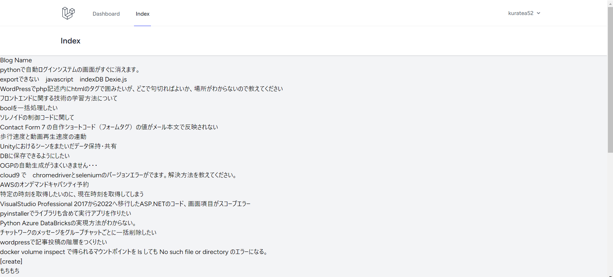
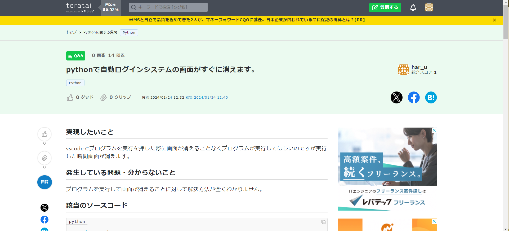
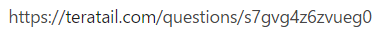

# 取得した質問一覧を表示する

## index.blade.php内で受け取った配列$questionsを表示する。

### 「blog/resources/views」配下にあるindex.blade.phpに下記を追記して、質問のタイトル一覧を取得と、各質問のidに対応したteratail質問ページへのリンクをつける。

    <body>
    略
        

            @foreach($questions as $question)
                

                    <a href="https://teratail.com/questions/{{ $question['id'] }}">
                        {{ $question['title'] }}
                    </a>
                

            @endforeach
        

    </body>

## アプリを起動して、修正内容が反映されていることを確認

#### $ php artisan serve --port=8080

* 起動後、下記のように質問一覧が表示されている。  

* 質問をクリックすると、teratailの質問ページに飛ぶ。  

* 飛んだ先のURLは、viewファイルで指定したものになっている。  
